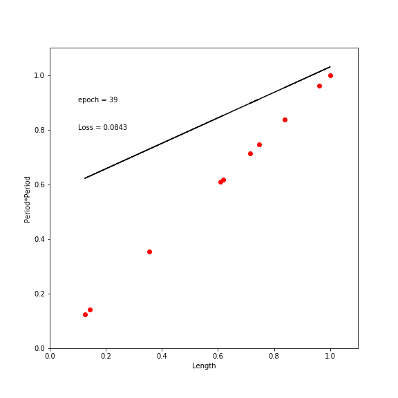

Using pytorch, I demonstrate how to do regression analysis. Our first example is simple and we only have a set of data including one independent and one dependent variables. The data set is generated on the fly ("period" and "length" of a simple pendulum experiment). 

The prediction loss is the mean squared error (MSE) and it is minimized using the stochastic gradient descent (SGD) method.

